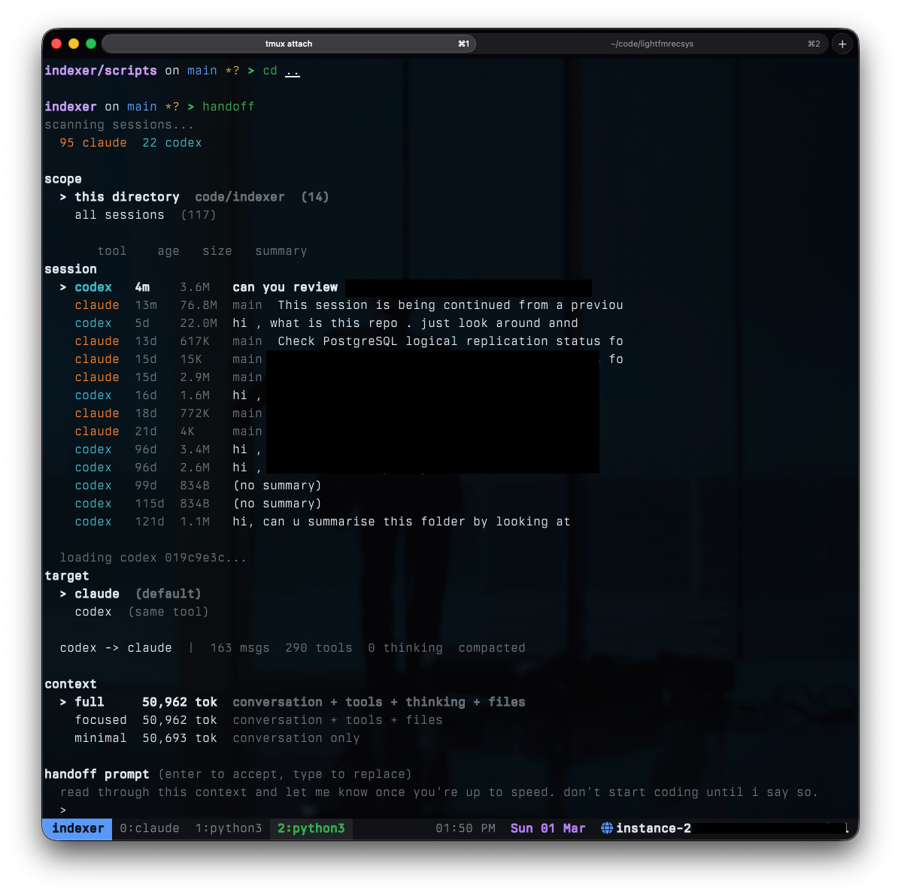

# handoff

session handoff tool for claude code and codex cli.



## install

```
uv tool install git+https://github.com/sahir2k/handoff
```

## usage

- `handoff` — interactive picker to select a session and hand it off to the other tool
- `handoff list` — list recent sessions across claude and codex
- `handoff scan` — show session discovery stats (counts, top dirs, branches, total size)
- `handoff skillsync` — sync skills, commands, and AGENTS.md to codex
